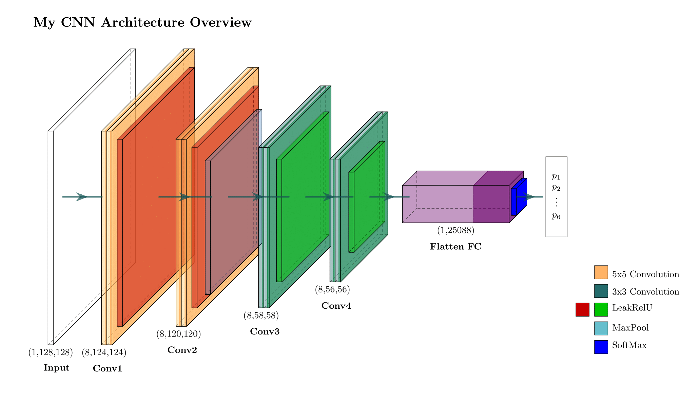

# Yoga Pose Classification with CNN from Scratch
DATASET==https://sites.google.com/view/yoga-82/home

This project explores the implementation of a Convolutional Neural Network (CNN) built entirely from scratch using NumPy. The goal is not state-of-the-art performance but to deepen understanding of how CNNs work mathematically and programmatically.
## CNN Architecture

The architecture is intentionally minimal:

1. `Conv2d(1 → 8, kernel_size=5)` → LeakyReLU  
2. `Conv2d(8 → 8, kernel_size=5)` → MaxPool(2x2) → LeakyReLU  
3. `Conv2d(8 → 8, kernel_size=3)` → LeakyReLU  
4. `Conv2d(8 → 8, kernel_size=3)` → LeakyReLU  
5. Flatten  
6. `Linear` → 6 output classes (yoga poses)  
7. `Softmax`

## Reflections on Theory

While building the model, several areas of the theory revealed a lack of formal clarity:

- **Why certain filter sizes or activation functions perform better** often isn't clearly explained in textbooks.
- The **intuition behind architecture choices** (e.g., when to pool, how many layers to use) is often presented as heuristics without rigorous justification.
- The trade-off between **model complexity and generalization** is more visible in practice than in theory.
